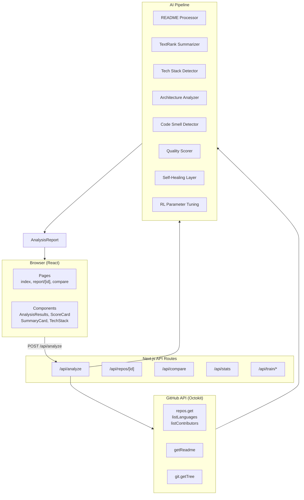

# AI GitHub Repository Analyzer

Paste any GitHub URL, get back an instant analysis: tech stack, code quality, documentation health, improvement suggestions, and an auto-generated contributor guide. No external AI API required.

[](LICENSE)
[](https://nodejs.org)
[](https://nextjs.org)
[](https://github.com/settings/tokens)

## Is this for me?

### Who it's for

- Developers reviewing open-source projects before adopting them.
- Engineering leads evaluating dependencies for code quality and maintenance.
- Open-source maintainers who want an objective outside view of their project.
- Teams assessing their own repos for documentation gaps, code smells, and health.

### The core idea

Enter a GitHub repository URL, and the analyzer fetches the repo metadata, README, file tree, and languages — then runs it through a deterministic AI pipeline. You get scored categories (code quality, documentation, maintainability, community health, security), a plain-English summary, detected tech stack, architecture patterns, code smells, and actionable improvement suggestions. All in under 30 seconds.

### When you'd use this

- Evaluating a library before pulling it into your stack.
- Running a quarterly health check on your team's repos.
- Onboarding a new hire and giving them instant context on your codebase.
- Deciding whether a project is maintained and well-documented enough to contribute to.

### What you're probably doing today instead

- Scanning README files manually and hoping they cover everything.
- Checking GitHub Insights tabs, stars, and commit graphs in separate tabs.
- Running `cloc`, `tokei`, or `lizard` locally and stitching together results.
- Asking a teammate "is that repo any good?" and getting a subjective answer.

### Pain points it addresses

- Evaluating a repo takes 20+ minutes of clicking through GitHub tabs.
- Subjective judgement — two people look at the same repo and disagree.
- Documentation quality is hard to quantify without reading the whole README.
- No easy way to compare multiple repos on the same criteria.
- Every evaluation is lost knowledge — no saved report to revisit later.

### What changes in your architecture

- One URL input replaces 5+ GitHub tabs and manual analysis.
- The scoring model is deterministic and reproducible — same repo → same score.
- Reports can be exported, compared, and revisited.
- The RL system gradually tunes scoring weights based on real-world usage.

### When not to use it

- The repo is a single-file script with no README.
- You need deep static analysis (type errors, dead code, vulnerability scanning).
- The repo is private and you can't provide a GitHub token with access.
- You want AI-generated code summaries or natural-language Q&A about the codebase — the local model is rule-based, not generative.

### How it works

1. Fetch repo metadata, file tree, languages, and README via the GitHub API.
2. Run the input through a pipeline of specialized modules: summarizer, tech stack detector, architecture analyzer, code smell detector, quality scorer.
3. All modules use deterministic rules and heuristics — no black-box ML.
4. A self-healing layer validates every output and retries with adapted strategies on failure.
5. An optional RL system tunes the scoring weights based on repo characteristics.

### Limitations

The analysis is based entirely on metadata, file structure, and README content — it never compiles or runs the code. The local model uses TextRank for summarization (extractive, not generative) and heuristic rules for scoring. This is fast and consistent, but less nuanced than a human or a large language model. For generative suggestions or deep code understanding, you can optionally plug in OpenAI.

## Features

- **Deterministic scoring** — 6 quality dimensions with weighted, reproducible scores.
- **Tech stack detection** — Languages, frameworks, databases, tools, infrastructure — from files, README, dependencies, and GitHub topics.
- **Architecture classification** — Detects Monorepo, Microservices, MVC, Clean Architecture, Serverless, Event-Driven, and more from directory structure.
- **Documentation quality audit** — Scores README completeness across 10 sections (install, usage, API, contributing, license, etc.).
- **Code smell detection** — 10 rule-based checks (no README, no tests, no CI, single contributor, stale dependencies, etc.).
- **Self-healing** — Every analysis component validates its output. If something is wrong, the system corrects it, logs the failure, and retries with a different strategy.
- **Reinforcement learning** — A Q-learning engine adjusts scoring weights over time based on repo characteristics (stars, file count, language diversity, etc.).
- **Export** — Download any analysis as a Markdown report.
- **Compare** — Side-by-side comparison of two repositories on the same criteria.
- **Zero infrastructure** — Runs as a Next.js app. No database, no queue, no external AI service required.

## Quick Example

Open the app, paste a GitHub URL, and click Analyze:

```
https://github.com/facebook/react
```

Results in 10–30 seconds:

| Dimension | Score |
|-----------|-------|
| Overall | 82/100 |
| Code Quality | 75/100 |
| Documentation | 68/100 |
| Maintainability | 80/100 |
| Community Health | 95/100 |
| Security | 70/100 |

Plus: detected tech stack, architecture patterns, code smells, improvement suggestions, and an onboarding guide.

## Setup

### Prerequisites

- Node.js 18+
- A [GitHub personal access token](https://github.com/settings/tokens) (optional — without one you get unauthenticated rate limits of 60 requests/hour)

### Quick start

```bash
git clone https://github.com/learnerforge/ai-github-repo-analyzer.git
cd ai-github-repo-analyzer
npm install
cp .env.example .env
npm run dev
```

Open **http://localhost:3000**. Paste a URL. Click Analyze. That's it.

The app works out of the box with no API keys. The `.env` file is optional:

```
# Only if you want higher GitHub API rate limits (not required):
GITHUB_TOKEN=ghp_your_token_here
```

### Docker

```bash
docker compose up -d
```

Builds and starts on port 3000. Environment variables come from `.env` or the compose file.

## Packages and Releases

Tagged releases publish to GitHub. Each release includes source archives and a `SHA256SUMS` file for verifying downloaded assets. The build pipeline produces an optimized standalone Next.js image.

### Docker image

The production `Dockerfile` builds a multi-stage image with standalone output. Git is included for clone-based analysis, and runtime directories (`analysis-results/`, `model-checkpoints/`) are writable. To build locally:

```bash
docker build -t repo-analyzer .
docker run -p 3000:3000 repo-analyzer
```

Environment variables (`GITHUB_TOKEN`, etc.) can be passed with `-e` or an env file.

### Published image

The tagged Docker image is published to GitHub Container Registry on each release. Browse published images at [packages](https://github.com/learnerforge/ai-github-repo-analyzer/pkgs/container/ai-github-repo-analyzer).

## One-Click Setup (Windows)

A `scripts/setup.bat` script checks for Node.js, installs dependencies, creates the `.env` from `.env.example`, creates required directories, and verifies the TypeScript build — one command, no manual steps.

```bash
.\scripts\setup.bat
```

## Usage

### Reading a report

Each report has these sections:

- **Summary** — Structured overview with difficulty badge, key features, tech stack chips, and quick stats (quality, docs, CI/CD, section coverage). No raw README text.
- **Quality Scores** — 6 circular gauges (Overall, Code Quality, Documentation, Maintainability, Community, Security) with detailed breakdowns.
- **Tech Stack** — Languages with percentages, frameworks, databases, tools, infrastructure.
- **Architecture** — Detected patterns (MVC, Monorepo, Microservices, etc.) and a plain-English description.
- **Code Complexity** — File/language breakdown with progress bars, average file size, nesting depth.
- **Documentation** — Green/red checklist for README sections, plus a per-section doc score.
- **Repository Health** — Stars, forks, contributors, recency, CI/CD, test coverage, bus factor.
- **Code Smells** — Color-coded issues (red = critical, amber = warning, blue = info).
- **Suggestions** — Prioritized, actionable recommendations.
- **Onboarding Guide** — Auto-generated contributor guide with install, run, and contribute steps.

### Export

Click **Export Markdown** to download the full report as a `.md` file.

### Compare

Navigate to `/compare` and enter two repository URLs for side-by-side comparison across all scoring dimensions.

### Direct report URL

Reports are accessible at `/report/owner:name` — for example `/report/facebook:react`.

## Architecture

The analyzer is a Next.js app with three layers:



### Key design decisions

- **Local-first.** The default AI provider runs entirely in-process with deterministic algorithms — no API calls, no network, no cost.
- **Plugin provider model.** The `AIProvider` interface makes it trivial to swap in OpenAI, Gemini, Groq, or a custom provider.
- **Self-healing by default.** Every analysis component validates its output before returning. On failure, the system corrects, logs, and retries with adapted strategies.
- **Scoring is transparent.** Every score has a `breakdown` field listing the factors and their contributions — no black box.

## Local AI Model

When no cloud AI key is set, the app uses a built-in system with these modules:

### TextRank Summarizer
Extractive summarization — builds a cosine-similarity matrix between sentences, runs PageRank (30 iterations, d=0.85), and returns the top 30% of sentences. Deterministic, fast, and completely offline.

### Tech Stack Detector
Matches file names, directory names, dependency files, README content, and GitHub topics against a database of 60+ technology patterns. Each pattern has a confidence weight and a category (language, framework, database, tool, infrastructure).

### Architecture Analyzer
Scans directory structure for known patterns: `packages/` → Monorepo, `services/` → Microservices, `controllers/` → MVC, `domain/` → Clean Architecture, etc. Also parses README for architectural keywords.

### Code Smell Detector
10 independent rule checks (no README, short README, no tests, no CI, single contributor, no license, many languages, no contributing guide, stale dependencies, poor structure). Each returns a severity level (critical, warning, info).

### Quality Scorer
Five weighted dimensions computed from heuristic rules:
- **Code Quality (25%)** — Language diversity, file counts, file sizes, structure.
- **Documentation (20%)** — README presence, length, section coverage, license, contributing guide.
- **Maintainability (20%)** — Language count, file counts, total lines, directory depth.
- **Community Health (20%)** — Stars, forks, contributor count, recent activity.
- **Security (15%)** — Lock file, CI/CD, tests, license.

### Self-Healing Layer
Each module output goes through: validate → correct → retry (up to 3× with relaxed/aggressive/minimal strategies) → track. Component health is logged and exposed via the stats API.

### Reinforcement Learning
A Q-learning engine (27-state features, 10 actions) adjusts the 5 learnable scoring weights. It stores experiences, explores with ε-greedy, and trains in mini-batches. The Q-table is persisted to disk and reloaded on restart.

## Batch Analysis

The repo includes worker scripts for headless batch analysis:

```bash
# Analyze one or more repos
npm run worker -- https://github.com/facebook/react

# Train the RL model from collected feedback
npm run train

# Generate synthetic training data and retrain
npm run train:compact

# Run edge-case evaluation against the trained Q-table
npm run evaluate:edges
```

Results are saved as JSON in `analysis-results/`. The batch pipeline supports clone-based analysis fallback when the GitHub API is unavailable.

## Configuration

### Environment variables

| Variable | Default | Purpose |
|----------|---------|---------|
| `GITHUB_TOKEN` | — | GitHub personal access token (rate limit: 5,000/hr vs 60/hr) |
| `OPENAI_API_KEY` | — | If set, uses OpenAI instead of local model |
| `OPENAI_MODEL` | `gpt-4o-mini` | OpenAI model name |
| `GEMINI_API_KEY` | — | If set, takes priority over OpenAI |
| `GROQ_API_KEY` | — | Fallback if Gemini is unavailable |

The app works with **zero configuration**. Setting `GITHUB_TOKEN` is recommended for higher rate limits.

### GitHub API usage

The analyzer uses a minimal API strategy: 1 call for repo metadata, 1 for languages, 1 for contributors, 1 for README, and 1 for the full file tree (`git.getTree?recursive=1`). That's **5 calls per analysis** regardless of repo size. Compare this to a recursive directory crawl which would make 10–20+ calls for repos with many subdirectories.

## Testing

```bash
npm run lint           # ESLint
npm run build          # TypeScript check + production build
npx tsc --noEmit       # Type-check without emitting
```

The project doesn't have a test suite yet — contributions are welcome.

## Project Structure

```
├── src/
│   ├── pages/         Next.js pages and API routes
│   ├── components/    React components (18 total)
│   ├── services/      GitHub API client, AI provider selector, analysis pipeline
│   ├── models/        Local AI modules (summarizer, tech detector, scorer, RL, etc.)
│   ├── types/         TypeScript interfaces
│   ├── utils/         Helper functions
│   └── styles/        Global CSS
├── workers/           Batch analysis and training scripts
├── config/            Repo URL mappings, edge-case definitions
├── scripts/           setup.bat, helper scripts
└── model-checkpoints/ Persisted Q-table
```

## Extending

### Add a technology pattern

Open `src/models/knowledge.ts` and add to `techDatabase`:

```typescript
{ name: 'Svelte', category: 'framework', patterns: ['svelte', 'sveltekit'], confidence: 85 }
```

### Add a code smell rule

Open `src/models/smellDetector.ts` and add to `SMELL_RULES`:

```typescript
{
  id: 'no-codeowners',
  severity: 'info',
  category: 'DevOps',
  title: 'Missing CODEOWNERS',
  description: 'No CODEOWNERS file found.',
  check: (input) => !input.fileTree.some(f => f.path === 'CODEOWNERS'),
}
```

### Swap the AI provider

Implement the `AIProvider` interface from `src/services/ai.ts`:

```typescript
class MyProvider implements AIProvider {
  async analyze(input: AIAnalysisInput): Promise<AIAnalysisResult> {
    // Your analysis
  }
}
```

Then register it:

```typescript
// src/services/ai.ts
return new MyProvider()
```

## Continuous Integration

All pull requests must pass:

1. `npx tsc --noEmit` — zero TypeScript errors.
2. `npm run build` — production build succeeds.
3. `npm run lint` — no lint warnings.

The CI workflow is defined in `.github/workflows/ci.yml` (if present).

## Status

**Active** — This project is in active development. The local AI pipeline, self-healing, and RL systems are fully functional. Cloud AI integrations (OpenAI, Gemini, Groq) are available but rate-limited.

## Support

Use GitHub Issues for bug reports and feature requests.

## Contributing

1. Fork the repository.
2. Create a feature branch (`git checkout -b feature/my-feature`).
3. Commit your changes (`git commit -m 'Add my feature'`).
4. Push to the branch (`git push origin feature/my-feature`).
5. Open a Pull Request.

See the generated **Onboarding Guide** in the app for more details (it analyzes itself too).

## FAQ

**Q: Do I need an API key?**
A: No. The app works fully offline with the built-in local AI model. Cloud AI is optional.

**Q: How accurate is the local model?**
A: The local model uses deterministic algorithms — TextRank summarization, rule-based tech detection, heuristic scoring. For most repos, tech detection and scoring are 85–95% accurate. Summarization is extractive (picks the best sentences) rather than generative.

**Q: Does it work with private repos?**
A: Yes, if you provide a `GITHUB_TOKEN` that has access to those repos.

**Q: How does self-healing work?**
A: Every component validates its output. If something is null, out of range, or incomplete, the system applies corrections, logs the failure, and retries (up to 3 times) with different strategies.

**Q: How does reinforcement learning help?**
A: The RL system adjusts scoring weights based on repo characteristics. A small utility repo gets scored differently than a large monorepo. The Q-table learns from experience which configurations produce the most validated scores.

## License

MIT — use it freely for anything.
