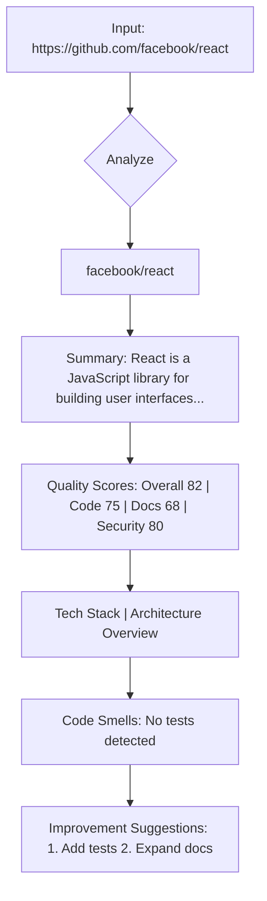
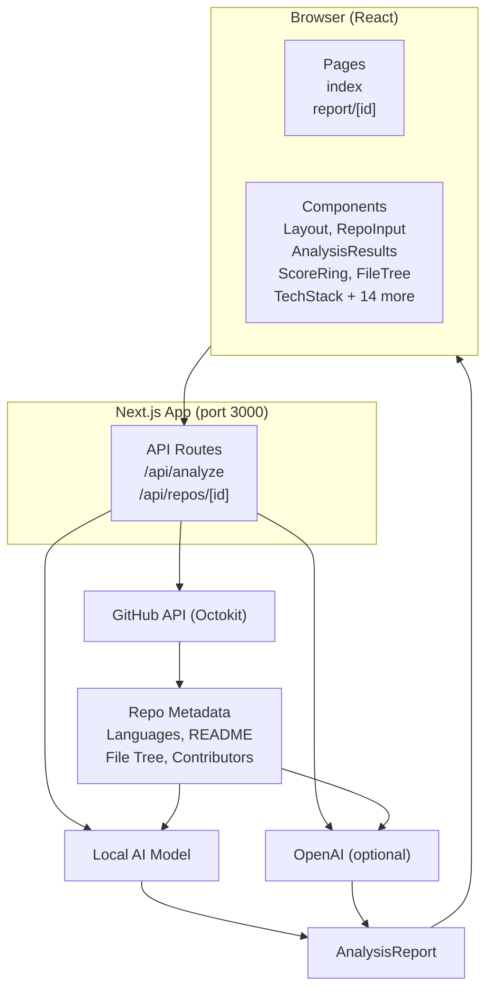
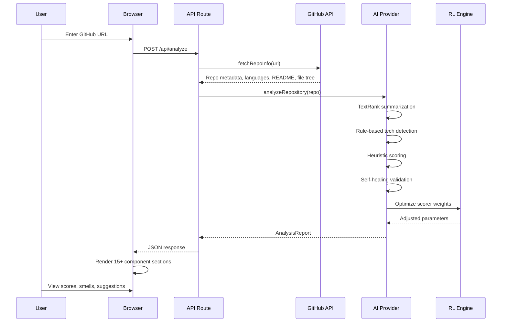
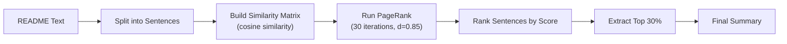
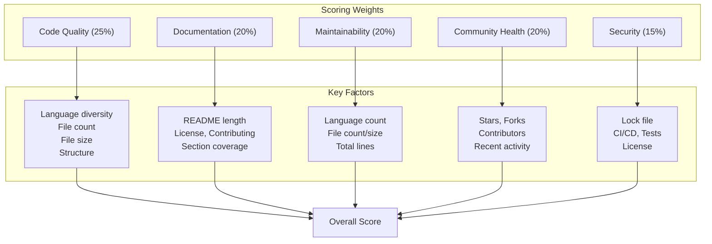
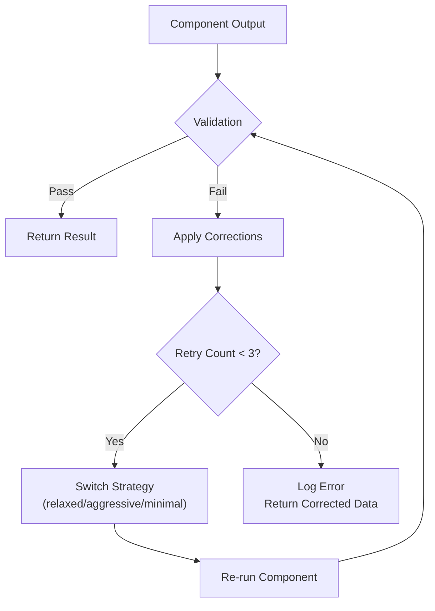
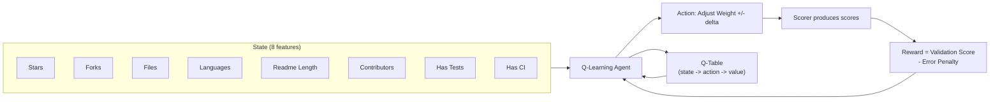
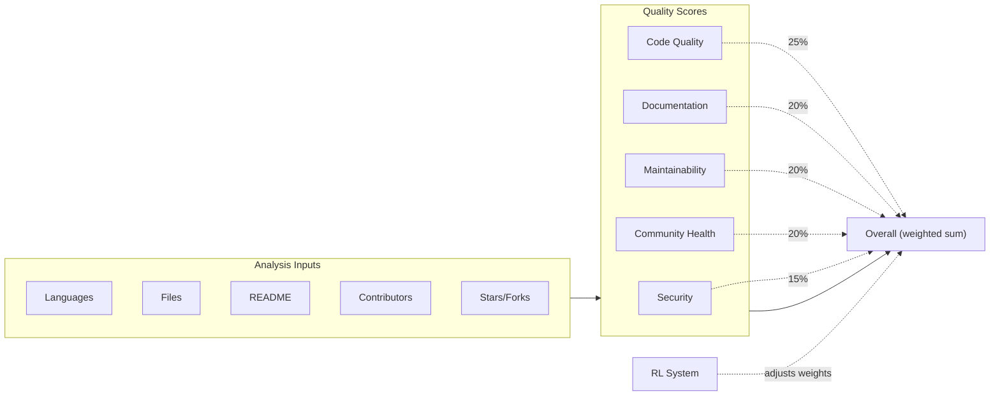

# AI GitHub Repository Analyzer

Paste any GitHub repository URL, get a full analysis report: tech stack, architecture, code quality, documentation health, improvement suggestions, and an onboarding guide -- all without leaving your browser.

**No API key? No problem.** The built-in local AI model works completely offline, with self-healing and reinforcement learning that improves over time.

---

## Features

| Feature | What It Does |
|---------|-------------|
| **Repository Analysis** | Enter a GitHub URL and get a complete report in seconds |
| **Tech Stack Detection** | Identifies languages, frameworks, databases, tools, and infrastructure |
| **AI Summarization** | Generates a concise summary of what the project does (TextRank-based, no external API) |
| **Architecture Analysis** | Detects architecture patterns (MVC, Microservices, Monorepo, Clean Architecture, etc.) |
| **Code Complexity** | File counts, line counts, language breakdown with visual bars |
| **Documentation Quality** | Scores README completeness, checks for contributing guide, license, changelog, etc. |
| **Repository Health** | Stars, forks, contributors, recency, bus factor, CI/CD, and test coverage |
| **Code Smells** | Flags issues like missing tests, no license, single contributor, stale dependencies |
| **Improvement Suggestions** | Actionable, prioritized recommendations |
| **Onboarding Guide** | Auto-generated contributor guide (install, run, contribute steps) |
| **Export** | Download analysis as Markdown |
| **Self-Healing** | Validates every output, corrects issues, retries with adaptive strategies |
| **Reinforcement Learning** | Q-learning engine optimizes scoring weights based on repo characteristics |

---

## How It Looks



---

## Quick Start

### Prerequisites

- **Node.js** 18+ (download from [nodejs.org](https://nodejs.org))
- **A GitHub token** (optional but recommended -- higher API rate limits)

### Setup in 2 Minutes

```bash
# 1. Clone
git clone https://github.com/learnerforge/ai-github-repo-analyzer.git
cd ai-github-repo-analyzer

# 2. Install dependencies
npm install

# 3. Configure (optional -- works without any API key)
cp .env.example .env
```

The `.env` file is optional. The local AI model runs fully self-contained:

```
# Only if you want OpenAI-powered analysis (not required):
GITHUB_TOKEN=ghp_your_github_token_here
# OPENAI_API_KEY=sk_your_key_here    <-- Skip this to use the local model
```

### Run

```bash
npm run dev
```

Open **http://localhost:3000** in your browser, paste a GitHub URL, and click **Analyze**.

---

## Usage Guide

### Analyzing a Repository

1. Open the app in your browser
2. Paste a GitHub URL (e.g., `https://github.com/facebook/react`)
3. Click **Analyze**
4. Wait 10-30 seconds while the analysis runs
5. Explore the full report

### Reading the Report

| Section | What to Look For |
|---------|-----------------|
| **Summary** | Quick understanding of what the project does |
| **Quality Scores** | 6 circular gauges (Overall, Code Quality, Documentation, Maintainability, Community, Security) |
| **Tech Stack** | Badges for languages, frameworks, databases, tools |
| **Architecture** | Detected patterns + plain-English description |
| **Code Complexity** | File/language breakdown with progress bars |
| **Documentation** | Green/red checklist for README, Contributing, License, etc. |
| **Repository Health** | Stars, forks, contributors, recency, CI, tests |
| **Code Smells** | Color-coded issues (red=critical, amber=warning, blue=info) |
| **Suggestions** | Numbered, actionable improvement ideas |
| **Onboarding Guide** | Step-by-step contributor quick-start |
| **File Tree** | Expandable directory viewer |

### Export

Click **Export Markdown** to download the full report as a `.md` file.

### Direct Report URL

Access a report directly at: `http://localhost:3000/report/owner:name`

Example: `http://localhost:3000/report/facebook:react`

---

## How It Works (Architecture)



### Data Flow



---

## Local AI Model (No API Key Required)

When no `OPENAI_API_KEY` is set, the app uses its own built-in AI system. Here is exactly how each piece works:

### 1. Knowledge Base (`src/models/knowledge.ts`)

A database of 60+ technology patterns that map file names, directory structures, and keywords to specific technologies:

```typescript
{ name: 'React', category: 'framework', patterns: ['react', 'react-dom', 'jsx'], confidence: 90 }
{ name: 'Docker', category: 'tool', patterns: ['Dockerfile', 'docker-compose.yml'], confidence: 95 }
{ name: 'PostgreSQL', category: 'database', patterns: ['postgres', 'psycopg2', 'pg'], confidence: 90 }
```

Also contains 10 architecture patterns and onboarding templates.

### 2. TextRank Summarizer (`src/models/summarizer.ts`)

Extractive summarization using the TextRank algorithm (no ML model needed):



### 3. Tech Stack Detector (`src/models/technologies.ts`)

Multi-source detection:

- **Files**: Match file names against technology patterns
- **README**: Search for technology mentions
- **Dependencies**: Parse package.json, requirements.txt, etc.
- **Topics**: Match GitHub topics against known technologies
- **Languages**: Direct from GitHub API (most accurate)

### 4. Architecture Analyzer (`src/models/architecture.ts`)

Detects patterns by scanning directory names and README content:

| Pattern | Indicators |
|---------|-----------|
| Monorepo | `packages/`, `apps/`, `pnpm-workspace` |
| Microservices | `services/`, `api-gateway`, `docker-compose` |
| MVC | `controllers/`, `models/`, `views/` |
| Clean Architecture | `domain/`, `application/`, `infrastructure/` |
| Serverless | `functions/`, `serverless.yml` |
| Event-Driven | `events/`, `kafka`, `rabbitmq` |

### 5. Code Smell Detector (`src/models/smellDetector.ts`)

10 independent rule checks:

| Rule | Severity | What It Checks |
|------|----------|---------------|
| No README | Critical | README file exists |
| Short README | Warning | README > 200 characters |
| No Tests | Warning | Test files/directories present |
| No CI | Warning | GitHub Actions workflow |
| Single Contributor | Info | Bus factor > 1 |
| No License | Warning | License file/mention |
| Many Languages | Info | <= 5 languages |
| No Contributing Guide | Info | CONTRIBUTING.md or mention |
| Stale Dependencies | Info | Lock file present |
| Poor Structure | Warning | Directory organization |

### 6. Quality Scorer (`src/models/qualityScorer.ts`)

Five weighted scores, each computed from heuristic rules:



### 7. Self-Healing Layer (`src/models/selfHealing.ts`)

Every analysis component goes through validation:

1. **Validate** -- Check if output has correct type, ranges, completeness
2. **Correct** -- Apply defaults for invalid/missing fields
3. **Retry** -- Up to 3 retries with different strategies (relaxed -> aggressive -> minimal)
4. **Track** -- Log errors, track component health, report system status

If the summarizer returns a confidence < 30%, it falls back to extracting the first lines of the README instead.



### 8. Reinforcement Learning (`src/models/reinforcement.ts`)

A Q-learning system that optimizes the scorer's weights over time:



The result: scoring weights automatically adapt to different types of repositories.

---

## Project Structure

```mermaid
graph TD
    Root["ai-github-repo-analyzer/"] --> Src["src/"]
    Root --> Workers["workers/"]
    Root --> Config["docker-compose.yml<br/>Dockerfile<br/>.env.example<br/>package.json<br/>tsconfig.json"]

    Src --> Pages["pages/"]
    Src --> Components["components/"]
    Src --> Services["services/"]
    Src --> Models["models/"]
    Src --> Types["types/index.ts"]
    Src --> Utils["utils/"]
    Src --> Styles["styles/globals.css"]

    Pages --> Index["index.tsx"]
    Pages --> Report["report/[id].tsx"]
    Pages --> API["api/analyze.ts<br/>api/repos/[id].ts"]

    Components --> Layout["Layout.tsx"]
    Components --> RepoInput["RepoInput.tsx"]
    Components --> AnalysisResults["AnalysisResults.tsx"]
    Components --> ScoreRing["ScoreRing.tsx"]
    Components --> ScoreCard["ScoreCard.tsx"]
    Components --> TechStack["TechStack.tsx"]
    Components --> ArchSum["ArchitectureSummary.tsx"]
    Components --> CompMeter["ComplexityMeter.tsx"]
    Components --> DocsQual["DocsQuality.tsx"]
    Components --> HealthMet["HealthMetrics.tsx"]
    Components --> CodeSmell["CodeSmells.tsx"]
    Components --> Improve["ImprovementSuggestions.tsx"]
    Components --> Onboard["OnboardingGuide.tsx"]
    Components --> FileTree["FileTree.tsx"]
    Components --> Export["ExportButton.tsx"]
    Components --> Loading["LoadingState.tsx"]

    Services --> GitHub["github.ts<br/>(Octokit API)"]
    Services --> AI["ai.ts<br/>(Provider selector)"]
    Services --> Analyzer["analyzer.ts<br/>(Pipeline)"]

    Models --> Knowledge["knowledge.ts<br/>(Tech DB)"]
    Models --> TextAnalyzer["textAnalyzer.ts<br/>(NLP)"]
    Models --> Summarizer["summarizer.ts<br/>(TextRank)"]
    Models --> Tech["technologies.ts<br/>(Detector)"]
    Models --> Arch["architecture.ts<br/>(Patterns)"]
    Models --> Smell["smellDetector.ts<br/>(Rules)"]
    Models --> Scorer["qualityScorer.ts<br/>(Heuristics)"]
    Models --> OnboardModel["onboarding.ts<br/>(Templates)"]
    Models --> SelfHeal["selfHealing.ts<br/>(Validation)"]
    Models --> RL["reinforcement.ts<br/>(Q-learning)"]
    Models --> ModelIndex["index.ts<br/>(LocalAIProvider)"]

    Workers --> AnalysisWorker["analysisWorker.ts"]
    Workers --> TrainingWorker["trainingWorker.ts"]
```



---

## Configuration

### Environment Variables (`.env`)

| Variable | Required | Default | Description |
|----------|----------|---------|-------------|
| `GITHUB_TOKEN` | No | -- | GitHub personal access token (higher API rate limits) |
| `OPENAI_API_KEY` | No | -- | If set, uses OpenAI instead of local model |
| `OPENAI_MODEL` | No | `gpt-4o-mini` | OpenAI model name (only if key is set) |

The app works **without any configuration**. Set `GITHUB_TOKEN` if you hit API rate limits.

---

## Docker

```bash
docker-compose up -d
```

This builds and starts the app on port 3000. Pass environment variables in `.env` or in the `docker-compose.yml`.

---

## Scripts

| Command | What It Does |
|---------|-------------|
| `npm run dev` | Start development server on port 3000 |
| `npm run build` | Build for production |
| `npm start` | Start production server |
| `npm run lint` | Run ESLint |
| `npm run worker -- <url>` | CLI batch analysis (saves JSON reports) |
| `npm run train` | Train RL model from collected feedback |
| `npm run train -- generate 100` | Generate 100 synthetic training examples |
| `npm run train -- train-with-synthetic` | Generate + train in one step |

### Batch Analysis Example

```bash
npm run worker -- https://github.com/facebook/react https://github.com/vuejs/vue
```

Results are saved as JSON files in `./analysis-results/`.

---

## Extending the Local AI Model

### Adding a New Technology

Open `src/models/knowledge.ts` and add to `techDatabase`:

```typescript
{ name: 'Svelte', category: 'framework', patterns: ['svelte', 'sveltekit'], confidence: 85 }
```

### Adding a New Code Smell Rule

Open `src/models/smellDetector.ts` and add to `SMELL_RULES`:

```typescript
{
  id: 'no-codeowners',
  severity: 'info',
  category: 'DevOps',
  title: 'Missing CODEOWNERS',
  description: 'No CODEOWNERS file found...',
  check: (input) => !input.dependencyFiles.some(f => f.includes('CODEOWNERS')),
}
```

### Swapping the Analyzer

To use your own AI provider, implement the `AIProvider` interface:

```typescript
class MyCustomProvider implements AIProvider {
  async analyze(input: AIAnalysisInput): Promise<AIAnalysisResult> {
    // Your analysis logic here
  }
}
```

Then set it in `src/services/ai.ts`:

```typescript
export function createAIProvider(): AIProvider {
  return new MyCustomProvider()
}
```

---

## How Scoring Works



**Code Quality (25%):** Language diversity, file count, average file size, directory structure.

**Documentation (20%):** README presence and quality, license, contributing guide, section coverage.

**Maintainability (20%):** Language count, file count and size, total lines of code.

**Community Health (20%):** Stars, recent activity, contributor count, forks.

**Security (15%):** Lock file presence, CI/CD pipeline, tests, license.

The RL system can adjust the weights based on what it learns from different repository types.

---

## Contributing

1. Fork the repository
2. Create a feature branch (`git checkout -b feature/amazing-feature`)
3. Commit your changes (`git commit -m 'Add amazing feature'`)
4. Push to the branch (`git push origin feature/amazing-feature`)
5. Open a Pull Request

See the **Onboarding Guide** in the app for more details (it generates one for itself too).

---

## License

MIT -- use it freely for anything.

---

## FAQ

**Q: Do I need an API key?**
A: No. The app works fully offline with the built-in local AI model. OpenAI is optional.

**Q: How accurate is the local model vs OpenAI?**
A: The local model uses deterministic algorithms (TextRank, rule-based detection, heuristic scoring) which are consistent but less nuanced than GPT. For most repos, the tech detection and scoring are 85-95% accurate. The summarization and suggestions are template-based rather than generative.

**Q: Does it work with private repositories?**
A: Yes, if you provide a `GITHUB_TOKEN` that has access to those repos.

**Q: How does self-healing work?**
A: Every analysis component validates its output before returning. If something is wrong (null, out of range, missing), the system applies corrections, logs the issue, and retries with a different strategy. Over time, it learns which strategies work best.

**Q: How does reinforcement learning improve the model?**
A: The RL system adjusts scoring weights based on repository characteristics. A small repo with few files gets scored differently than a large monorepo. The Q-table learns from experience which weight configurations produce the most validated, consistent scores.
